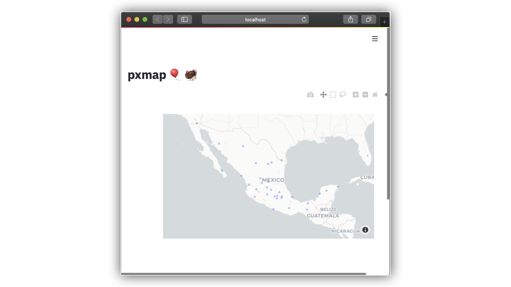

# stvis
**Component for rendering scatter_mapbox with plotly express  in Streamlit**



## Installation

```python
pip install pxmap
```

## Example

```python
import streamlit as st
from pxmap import px_static
import pandas as pd
import plotly.express as px

st.title('pxmap :balloon: :turkey:')

d3=pd.read_csv("https://raw.githubusercontent.com/napoles-uach/covid19mx/master/estadoslatlon.csv")
fig = px.scatter_mapbox(d3, lat=d3['Lat'], lon=d3['Long'],opacity=0.4)
#
fig.update_layout(mapbox_style='carto-positron')
#fig.update_layout(mapbox_style='open-street-map')
#fig.update_layout(mapbox_style="carto-darkmatter")


px_static(fig)
```

