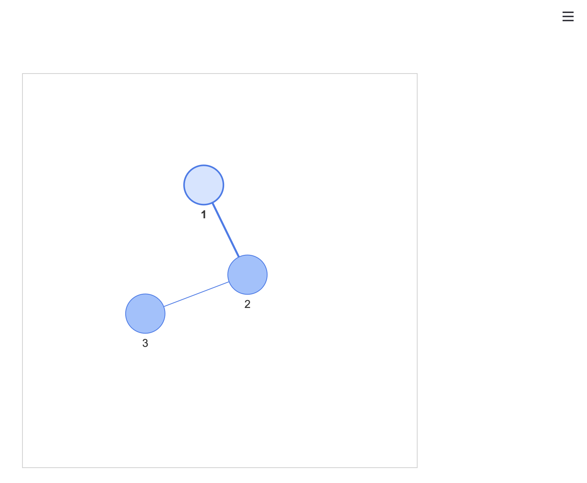

# stvis
**Component for rendering pyvis graphs in Streamlit**



## Installation

```python
pip install stvis
```

## Example

```python
from pyvis import network as net
import streamlit as st
from stvis import pv_static

g=net.Network(height='500px', width='500px',heading='')
g.add_node(1)
g.add_node(2)
g.add_node(3)
g.add_edge(1,2)
g.add_edge(2,3) 

pv_static(g)
```

